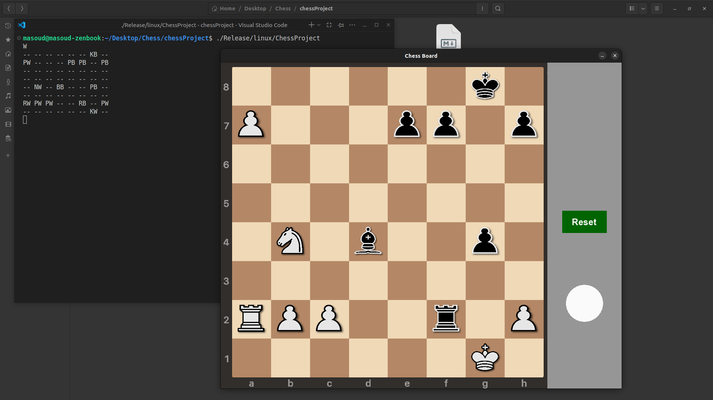
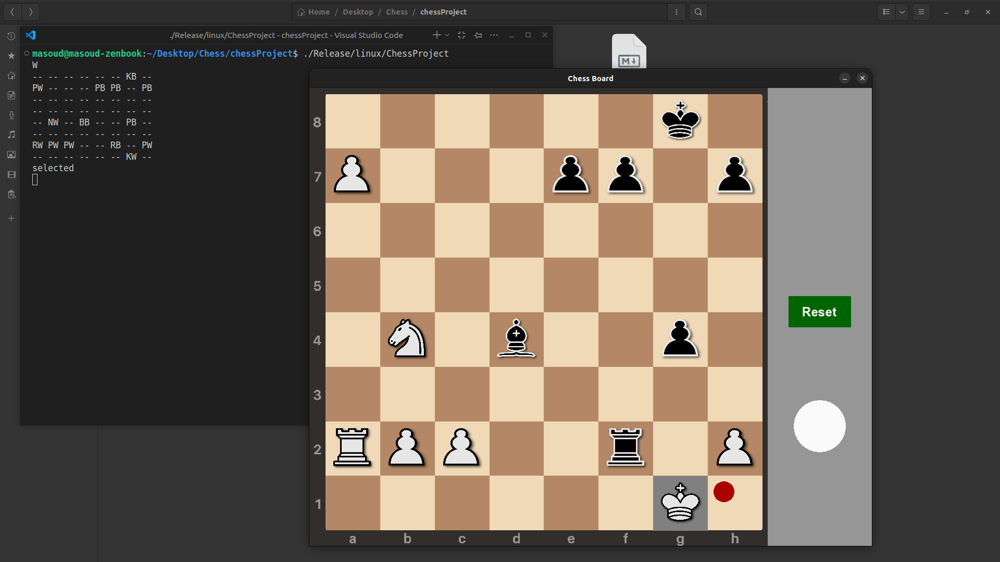
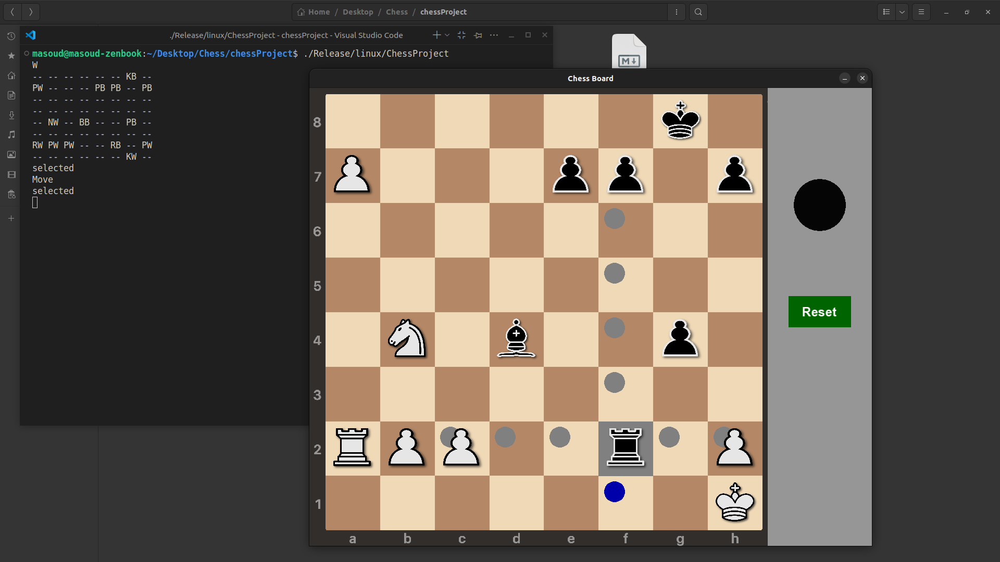
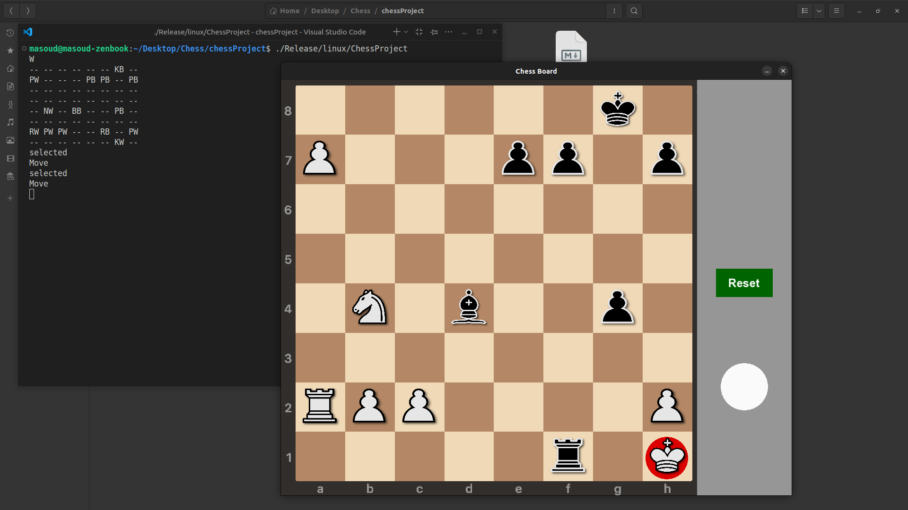
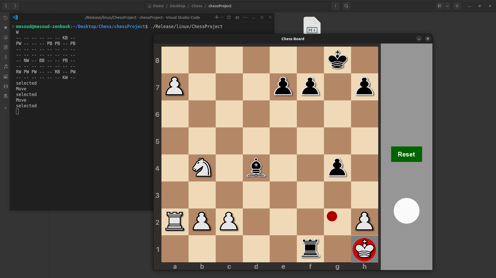
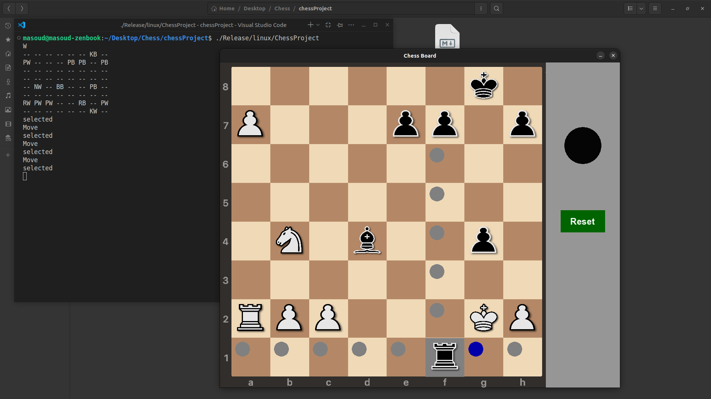
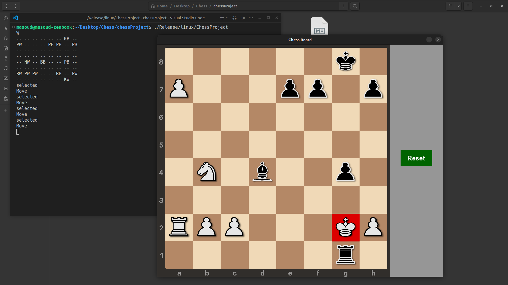
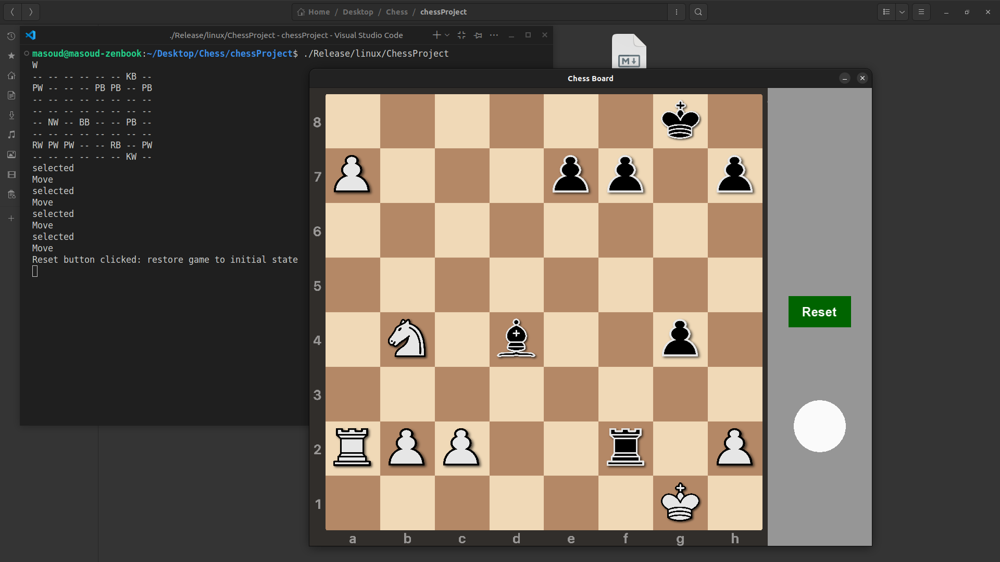

# Chess Project
This project is a graphical chess application developed using the SFML library and built with CMake.

--- 

### Requirements
To build and run this project, the following tools and libraries are required:  
- A C++ compiler with C++17 support (GCC or Clang recommended)
- CMake (version 3.10 or higher)
- SFML (Simple and Fast Multimedia Library)

---
### How to Run
1. Download the following:
    - cppFiles folder
    - headers folder
    - assets folder
    - CMakeLists.txt
2. Place all of them in the same directory.
3. Build and run the project using CMake.
---


### Build on Unix-Based Systems (Linux / macOS)
Follow these steps in the project directory:
```
cmake .
cmake --build .
./ChessProject
```
A prebuilt Linux executable is provided in the Releases section of this repository.

---


### Program Input Format

After building the project with CMake and running the executable, you must provide the current board configuration through the console in 9 lines : 

- Line 1: Enter B or W to indicate which player's turn it is (Black or White).

- Next 8 lines: Specify the board configuration.

Example: Initial Chess Position
    
``` 
W
RB NB BB QB KB BB NB RB  
PB PB PB PB PB PB PB PB  
-- -- -- -- -- -- -- --  
-- -- -- -- -- -- -- --  
-- -- -- -- -- -- -- --  
-- -- -- -- -- -- -- --  
PW PW PW PW PW PW PW PW  
RW NW BW QW KW BW NW RW 
```
### Piece Notation
Each square contains two characters:
- The first letter represents the piece type.
- The second letter represents the piece color.

Piece types:
- K – King
- Q – Queen
- B – Bishop
- N – Knight
- R – Rook
- P – Pawn

Colors:
- W – White
- B – Black

Empty squares are represented by ```--``` .

---

### Emergency Move Detection

This program is capable of detecting critical game situations and notifying the player visually.

#### Type 1 – Critical Mistake (Displayed in Red)

If a move is played that inevitably leads to checkmate within a maximum of two opponent moves (assuming the opponent plays optimally).  
The move is marked in red.

#### Type 2 – Forced Mate (Displayed in Blue)

If a move guarantees checkmate in your second move, regardless of the opp-- -- --onent’s response  
The move is marked in blue.

---

### Features
#### Piece Selection
When a player clicks on a piece, it becomes selected and all valid moves for that piece are displayed on the board.

#### Check Indication

When a king is in check, its square is highlighted in red.

#### Reset Function

The board can be reset to the initial input configuration at any time.
The current player's turn is also restored accordingly.

---

### Demonstration of Emergency Move Detection
In the following position, both special detection features (Critical Mistake and Forced Mate) can be observed:  
‍‍‍‍
```
W
-- -- -- -- -- -- KB --
PW -- -- -- PB PB -- PB
-- -- -- -- -- -- -- --
-- -- -- -- -- -- -- --
-- NW -- BB -- -- PB --
-- -- -- -- -- -- -- --
RW PW PW -- -- RB -- PW
-- -- -- -- -- -- KW --
``` 
<p align="center"> 
     <br> 
    <em>Initial position</em> 
</p>

#### Step 1 – Critical Mistake (Red Highlight)
In this position, if the White __king moves to the corner of the board__, Black has a forced checkmate in two moves.  
Therefore, this move is marked with a red circle, indicating a critical mistake.

<p align="center"> 
     <br> 
    <em>White king moves to h1 – critical mistake highlighted in red.</em> 
</p>

#### Step 2 – Black Begins the Mate Sequence
Black can play __Rook to f1__, initiating the forced mating sequence.

<p align="center"> 
     <br> 
    <em>Black plays Rook to f1.</em> 
</p>


This move puts white in __check__, So the White king’s square is highlighted.  

<p align="center"> 
     <br> 
    <em>The White king is in check.</em> 
</p>

#### Step 3 – White’s Only Legal Move
White has only one legal move available: __King to g2__

<p align="center"> 
     <br> 
    <em>White plays King to g2 – the only legal move.</em> 
</p>

#### Step 4 – Checkmate
Black finishes the game with __Rook to g1__.  

<p align="center"> 
     <br> 
    <em>Black plays Rook to g1.</em> 
</p>

This results in checkmate. The White king’s square is highlighted in red, and the turn indicators are no longer displayed. Only the Reset button remains available.  

<p align="center"> 
     <br> 
    <em>Final checkmate position.</em> 
</p>


To restart the game, click the Reset button anytime.  

<p align="center"> 
     <br> 
    <em>Click the Reset button to restore the initial board state.</em> 
</p>
